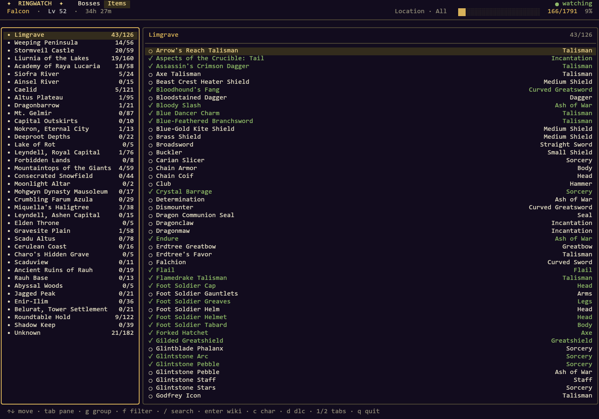

# RingWatch

A fast, beautiful terminal UI that reads your **Elden Ring** save file and shows,
at a glance, what you still have left to do — which **bosses** to fell, which
**items** (weapons, armor, spells, talismans, ashes of war, spirit ashes) you have
yet to collect, and where you stand in every **NPC questline** — across the base
game and *Shadow of the Erdtree*. It watches your save and updates live as you play.

Pure Go, Linux-first. Built with [Bubble Tea v2](https://charm.land) and
[Lip Gloss v2](https://charm.land).

> **Inspired by** [RysanekDavid/The-Tarnished-Chronicle](https://github.com/RysanekDavid/The-Tarnished-Chronicle).
> RingWatch is an independent Go reimagining focused on a fast Linux TUI for boss,
> item, and questline tracking — no external tools, no OBS/overlay.



## Features

- **Reads your real save** — parses the `ER0000.sl2` BND4 container directly (no
  external tools, no Wine). Elden Ring PC saves are *not* encrypted.
- **All 208 bosses** with a health bar, grouped by region in progression order,
  split into Early / Mid / Late game and the DLC.
- **1,800+ items** — every weapon, shield, armor piece, sorcery, incantation,
  talisman, ash of war and spirit ash (base + DLC), read straight from your
  inventory. The **Items** tab regroups on the fly: by **location**, by
  **category**, by **weapon type**, or by **primary stat**, with a per-kind filter.
  Item data is generated from the game's own `regulation.bin` (see below).
- **Every NPC questline** — the **Quests** tab breaks each quest down by quest-giver
  on the left and ordered steps on the right, each step with concrete *what to do /
  where to go* instructions and missable-step warnings. Your position in each quest
  is read **from the save**: steps are anchored to event flags (quest-item receipts,
  quest-exclusive boss defeats) and to inventory ownership of the reward, then rolled
  up so the first incomplete step is always your accurate next objective. 43
  questlines spanning the base game and *Shadow of the Erdtree* (Ranni, Millicent,
  the Volcano Manor assassins, Fia, the Frenzied Flame, Leda's band, Count Ymir, and
  more).
- **Live updates** — watches the save file and shows a toast the moment a boss
  falls; no need to restart.
- **Multiple characters** — pick any of your save slots.
- **Search** any boss by name across every region.
- **Clickable boss links** — each boss links to its Fextralife wiki page via
  OSC 8 terminal hyperlinks (click, or press `enter` to open in your browser).
- **Auto-detects** your save across all Steam libraries (parses
  `libraryfolders.vdf`, supports non-default libraries and Flatpak Steam).

## Install

Requires Go 1.26+.

```sh
go build -o ringwatch ./cmd/ringwatch
# or install to $GOBIN:
go install github.com/Cidan/RingWatch/cmd/ringwatch@latest
```

## Usage

```sh
ringwatch                      # auto-detect the save, track the first character, watch live
ringwatch --slot 2             # track save slot index 2
ringwatch --save /path/ER0000.sl2   # use a specific save file (.sl2 or .co2)
ringwatch --no-watch           # don't watch for changes
```

### Keys

| Key | Action |
| --- | --- |
| `1` / `2` / `3` | Switch between the **Bosses**, **Items**, and **Quests** views |
| `↑`/`↓` or `k`/`j` | Move selection |
| `tab` / `←` `→` | Switch between the left (groups / quest-givers) and right (entries / steps) panes |
| `g` | *(Items)* Cycle grouping: Location → Category → Weapon Type → Primary Stat |
| `f` | *(Items)* Cycle the category filter (All / Weapons / Armor / Sorceries / …) |
| `/` | Search by name across the current view (*Quests*: search quest-givers) |
| `enter` / `o` | Open the selected entry's wiki page (*Quests*: the step's location or the questline) |
| `c` | Choose a different character |
| `d` | Toggle DLC content |
| `esc` | Clear the active search |
| `q` / `ctrl+c` | Quit |

## How it works

Elden Ring PC saves are plaintext **BND4** containers (the only integrity check
is a per-section MD5 — there is no AES encryption, contrary to popular belief).
RingWatch:

1. Reads the profile summaries (`user_data_10`) for the character list
   (name, level, playtime, occupied slots).
2. Walks each character slot to locate its event-flags blob, whose offset is
   variable (several preceding fields are data-dependent).
3. Maps each boss's event-flag id to a bit in that blob using the block→group
   table from [ClayAmore/ER-Save-Lib](https://github.com/ClayAmore/ER-Save-Lib).

For **items**, RingWatch parses each character's inventory (held items + storage
box) from the same slot, resolving owned weapons/armor/talismans/spells/ashes via
the in-save GaItem table, and matches them against an embedded item dataset
generated from the game's `regulation.bin` (see *Regenerating the item dataset*).

For **quests**, each questline is an ordered list of steps in an embedded dataset.
Every step is anchored to one or both of two save-derived signals: an **event flag**
(the same id space as boss flags — quest-item receipts and quest-exclusive boss
defeats) and **inventory ownership** of the step's reward item (the mechanism the
Items view already uses, which is what gives the DLC questlines real progress, since
their flags aren't in the base data). Completion **rolls up monotonically** — a step
counts as done if its own anchor *or* any later step's anchor is satisfied — so the
first incomplete step is always an accurate "what to do next", even where an
intermediate beat ("talk to X") has no dedicated flag. A questline with no resolvable
anchor at all is shown as a reference guide (marked `◇`) rather than faked as
unstarted.

## Layout

```
cmd/ringwatch      entry point + flags
cmd/gen-items      regulation.bin → items.generated.json dataset generator (dev tool)
internal/save      BND4 parsing, profiles, event flags, inventory
internal/tracker   boss + item + quest datasets (embedded) + progress / grouping / roll-up
internal/config    Steam save-path auto-detection
internal/watcher   fsnotify-based live watcher
internal/locations Fextralife links + OSC 8 hyperlinks
internal/ui        Bubble Tea v2 / Lip Gloss v2 TUI
```

### Regenerating the item dataset

`internal/tracker/data/items.generated.json` is produced from the game's own
`regulation.bin` by a pure-Go generator — no external tools:

```sh
go run ./cmd/gen-items                                    # uses the detected game path
go run ./cmd/gen-items -regulation /path/to/regulation.bin
```

It decrypts `regulation.bin` (AES-256-CBC), inflates the DCX/ZSTD payload, splits the
BND4, and reads the weapon / protector / accessory / goods / magic / gem params using
field offsets computed from vendored [Paramdex](https://github.com/soulsmods/Paramdex)
definitions. Item names come from vendored Paramdex name tables; acquisition locations
are merged from curated per-kind data plus the MIT
[Mjolniar](https://github.com/Mjolniar/elden-ring-index-build-planner) Fextralife
dataset. Re-run it after a game patch to refresh the items.

## Credits & data

- Inspired by [The Tarnished Chronicle](https://github.com/RysanekDavid/The-Tarnished-Chronicle);
  boss → event-flag data was assembled from its dataset and cross-checked against
  Paramdex, ERTools, and other community sources.
- Event-flag location table from [ER-Save-Lib](https://github.com/ClayAmore/ER-Save-Lib).
- Item data generated from the game's `regulation.bin` using
  [Paramdex](https://github.com/soulsmods/Paramdex) definitions/names; binary formats
  per [SoulsFormats](https://github.com/JKAnderson/SoulsFormats).
- Item acquisition locations from the MIT
  [Mjolniar build planner](https://github.com/Mjolniar/elden-ring-index-build-planner)
  dataset plus curated wiki research.
- Quest step text is sourced from the [Elden Ring Fextralife wiki](https://eldenring.wiki.fextralife.com);
  quest-step event flags were harvested from the reverse-engineered EMEVD data in
  [thefifthmatt/SoulsRandomizers](https://github.com/thefifthmatt/SoulsRandomizers)
  (`itemevents.txt`) and verified against the embedded item/boss datasets.
- Boss, item, and quest links to the [Elden Ring Fextralife wiki](https://eldenring.wiki.fextralife.com).

## Roadmap

- Deeper location coverage for the long tail (generic armor pieces, spirit-ash variants).
- Location overrides for any mismatched wiki links.
- Finer per-step quest flags (from decompiled TALK scripts) for the handful of
  questlines currently shown as reference guides (`◇`) for lack of a save signal.

Not affiliated with FromSoftware or Bandai Namco.
